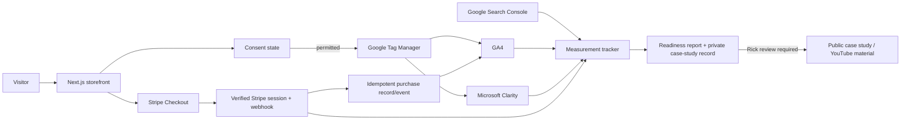

# Marilyn's Morsels Readiness, Measurement, and Case Study Design

**Date:** 2026-07-17

**Owner:** Michael Caldwell

**Client contact:** Rick Tonelli

**Site:** https://marilynsmorsels.com

**Repository:** `C:\Users\MBC\Codebases\client-projects\marilynsmorsels`

**Source agreement:** [Marilyn's Morsels — Website Readiness Package Agreement & Invoice](https://docs.google.com/document/d/1ZiaTkNufQQlmxDeAG2hsMOb_WTpFYF0htc2IoDTDUWY/edit)

## 1. Purpose

Prepare Marilyn's Morsels for Rick to show to prospective customers without embarrassment, establish transferable analytics and search measurement, verify the real purchasing path, and create an evidence system that can support both future optimization work and an honest public case study.

The engagement is a bounded readiness package. It is not a redesign or an open-ended SEO/CRO implementation. It deliberately overdelivers through evidence quality, diagnostic depth, a polished roadmap, and a reusable measurement system.

## 2. Success Conditions

The engagement succeeds when all of the following are true:

- Rick's confirmed product prices and operating facts are reflected accurately in the buyer path and relevant policies.
- The primary public pages and shopping journey are presentable and usable on mobile without horizontal overflow, clipped content, or inaccessible controls.
- All expected public routes and discovered internal links resolve correctly.
- A guest can select a product, use the cart, enter checkout, pay through production Stripe, trigger the expected webhook/order handling and customer notification, and receive a refund during the authorized QA purchase.
- Google Tag Manager, GA4, Microsoft Clarity, and Google Search Console are owned by `marilynsmorselsbakery@gmail.com`, with Michael's working account added as an administrator where supported.
- GA4 receives verified funnel events, including an idempotent Stripe-verified `purchase` event.
- Microsoft Clarity receives permitted session and behavior data without intentionally collecting sensitive or payment information.
- Search Console is verified, the sitemap is submitted, and the initial indexing/search baseline is recorded.
- Privacy disclosures accurately describe the installed measurement tools and consent behavior.
- A client-facing readiness report, prioritized CRO/SEO roadmap, measurement tracker, evidence archive, and initial video-diary entry exist.
- The site receives a final status of **Ready**, **Ready with warnings**, or **Not ready**, supported by test evidence.

## 3. Controlling Scope Interpretation

The written agreement excludes redesign and general code repairs, but the controlling client intent is presentation readiness: Rick wants to show the site without embarrassment. Therefore, objective mobile presentation defects are implementation work inside this package.

### In scope

- Measurement-property creation and ownership setup.
- Google Tag Manager installation and a code-owned event data layer, with GA4 and Microsoft Clarity deployed through the client-owned GTM container.
- GA4 ecommerce, lead, and supporting-event instrumentation.
- Microsoft Clarity installation and useful custom-event integration where supported.
- Google Search Console verification, sitemap submission, and baseline capture.
- Consent-aware loading and necessary Privacy Policy/cookie-disclosure updates.
- Mobile corrections on the primary buyer journey while preserving the existing visual direction.
- Route, internal-link, product-selector, cart, checkout, Stripe, webhook, order-notification, cancellation, refund, and bulk-inquiry verification.
- Technical SEO readiness inspection: crawlability, indexability, metadata, canonicals, sitemap, robots directives, structured data, and current search visibility.
- Policy and operational-claim consistency review.
- Corrections to objective inaccuracies that do not require a new business decision or a substantial rewrite.
- Readiness report, evidence tracker, CRO/SEO roadmap, case-study evidence, and the contracted later-month check.

### Out of scope

- New branding or visual identity.
- Broad desktop redesign or new page architecture.
- New product-detail pages, content library, or ongoing SEO program.
- New photography, reviews platform, subscription product, referral program, loyalty system, or other conversion feature.
- Legal advice or a representation that the policies guarantee regulatory compliance.
- Open-ended development, maintenance, or recurring optimization.
- Publishing case-study material before Rick reviews the final public version.

## 4. Ownership and Access

The client Gmail account, `marilynsmorselsbakery@gmail.com`, is the permanent owner or primary administrator of the measurement properties. Michael receives the access needed for implementation and ongoing service. This keeps the stack transferable if the working relationship changes.

Property/account inventory:

- Google Tag Manager web container
- GA4 property and web data stream (`G-BRH7YVV7C6`)
- Microsoft Clarity project (`xo0giy5fnb`)
- Google Search Console domain or URL-prefix property
- Existing Vercel Analytics and Speed Insights

Credentials must not be copied into the repository, reports, screenshots, videos, or the case-study tracker. A previously encountered Drive spreadsheet contains plaintext account credentials; it must not be used as a credential source for this project. Credential rotation and migration to a password manager will be raised as a confidential security recommendation.

## 5. Measurement Architecture

### Design rules

- Measurement failure must never prevent browsing, cart use, checkout, or payment.
- Analytics tags load only according to the implemented consent state.
- Only the GTM container snippet is installed in the application. The GA4 measurement ID and Clarity project ID are configured inside GTM so tracking scripts are not duplicated in page files.
- One typed event interface pushes only approved, non-PII event names and parameters to `dataLayer`; GTM routes those events to each permitted analytics destination.
- No card data, customer names, street addresses, email addresses, free-form inquiry text, or other personally identifiable information is sent to analytics.
- `purchase` is emitted only after Stripe verifies the Checkout Session.
- Reloading or revisiting the success page must not create a duplicate purchase event.
- The authorized QA purchase and refund are labeled in the internal evidence log and excluded from public claims about customer sales.
- Existing Vercel Analytics and Speed Insights remain supporting sources; they do not replace GA4, Clarity, or Search Console.

## 6. Event Taxonomy

### Key events

| Event | Business meaning | Classification | Verification |
| --- | --- | --- | --- |
| `purchase` | Stripe-verified completed online order | Primary conversion | Verified Checkout Session, unique transaction ID, webhook/order evidence |
| `generate_lead` | Successfully submitted bulk-order inquiry | Secondary conversion | Successful server response and stored/delivered inquiry evidence |

### Supporting events

| Event | Trigger | Diagnostic purpose |
| --- | --- | --- |
| `view_item_list` | Shop/catalog displayed | Measures catalog exposure |
| `select_item` | Visitor selects or opens a product | Measures product interest |
| `view_item` | Product detail is shown | Measures deeper consideration |
| `add_to_cart` | Valid product/variant enters cart | Measures purchase intent |
| `view_cart` | Cart drawer/page is opened | Measures cart review |
| `begin_checkout` | Valid cart proceeds to checkout | Locates cart-to-checkout loss |
| `checkout_error` | Checkout creation or redirect fails | Detects technical revenue leaks |
| `contact_click` | Visitor activates a contact link | Supporting service intent |

Event parameters use product IDs, SKUs, categories, values, quantities, currency, and transaction identifiers only where appropriate. They do not include personally identifiable information.

## 7. Search Measurement

GA4 measures visits and onsite behavior; it does not create traffic. Search Console provides the acquisition baseline needed to document whether search visibility changes.

The initial search record will capture:

- Property verification status
- Sitemap submission and processing status
- Indexed and excluded pages visible at baseline
- Search impressions, clicks, queries, pages, countries, and devices when data exists
- Any manual actions, security notices, or enhancement reports exposed to the property

No search-ranking, traffic, conversion, or revenue improvement is promised. If the site remains low traffic, the case study will report the lack of volume honestly and focus on readiness, measurement, and observed behavior.

## 8. Mobile Presentation Standard

Mobile revision is in scope. The existing brand and desktop direction remain intact.

Acceptance checks cover representative widths at 320, 375, 390, and 430 CSS pixels, plus tablet and desktop checks at 768, 1024, and 1440 CSS pixels.

The site must meet these conditions:

- No horizontal document scrolling caused by page content.
- No clipped headline, paragraph, image, selector, price, or button text.
- Header branding and the mobile-menu control fit within the viewport.
- The mobile menu opens, closes, traps or manages focus appropriately, and exposes all required navigation and cart actions.
- Hero copy and both primary calls to action remain readable and tappable.
- Product cards, variant buttons, Half & Half selectors, quantities, prices, details buttons, and add-to-cart buttons wrap without collision.
- Product detail, ingredient, and cart dialogs remain usable with keyboard and touch input.
- Checkout rows, totals, shipping language, and payment CTA fit cleanly.
- Forms, policy pages, authentication pages, success/cancel states, and error states remain readable and operable.
- Before/after screenshots prove the corrected presentation at the affected viewports.

The measured baseline already shows clipping on the homepage and shop at a 390-pixel viewport. Those are confirmed defects, not speculative recommendations.

## 9. Commerce and Functional Readiness

The functional test matrix includes:

- Product catalog loads and matches Rick's confirmed catalog.
- Every product and pack-size selector produces a valid Stripe-backed variant.
- Half & Half choices enforce valid selections and preserve order metadata.
- Cart add, quantity update, remove, empty, reopen, and persistence behavior works.
- Empty checkout redirects safely.
- Valid carts create Stripe Checkout Sessions using server-fetched prices.
- Stripe shows the expected line items, prices, address collection, shipping behavior, and final total.
- Cancel returns the buyer safely without creating an order.
- Successful payment returns through a session-specific success path.
- The webhook records the expected order result without exposing secrets.
- Rick receives the expected operational notification and the test buyer receives the expected confirmation.
- Reloading the success page does not duplicate the purchase event or order.
- The authorized live QA order is refunded and the refund is documented.
- Bulk inquiry submission succeeds and reaches its intended destination.

Rick's confirmation of the real catalog prices is a hard dependency. The site cannot receive **Ready** status while public prices remain unconfirmed.

## 10. Policy and Claim Consistency

The review covers Privacy, Terms, Shipping, Returns, FAQ, product copy, cart, checkout, success/cancel states, and structured-data claims.

Known issues requiring resolution or confirmation include:

- Privacy language currently omits GA4 and Clarity and states that no third-party tracking cookies are used.
- Shipping copy says rates are calculated at checkout, while the current checkout code does not visibly configure shipping rates.
- Cookie dough is described as local-delivery-only, while the current checkout accepts US shipping addresses without an observed dough-specific restriction.
- The success page promises account-based tracking even for a guest purchase path that does not visibly link a guest order to an account.
- Fulfillment timing differs across public pages.
- The repeated claim that the bakery uses a licensed home kitchen requires Rick's factual confirmation.
- Allergen, delivery-radius, pickup, carrier, return-window, and fulfillment claims require business-owner confirmation before being treated as authoritative.

The project may correct clear internal contradictions and analytics disclosures. It will not invent operating policies or make legal judgments for Rick. Unconfirmed business facts become explicit readiness warnings or blockers.

## 11. Technical SEO Readiness

The readiness pass verifies:

- Public pages return expected status codes.
- Error routes return a true `404`.
- Robots directives match the intended public/private page set.
- Sitemap contains only pages that should be discoverable and uses supportable modification data.
- Public pages have unique titles and descriptions where appropriate.
- Canonical URLs are consistent.
- Structured data matches visible page content and confirmed business facts.
- Authentication, account, checkout, success, and cancellation pages use an intentional indexing posture.
- Open Graph and social preview output resolve.
- Internal navigation has no broken destinations.
- Search Console can fetch the sitemap and report the initial index state.

New SEO content, link acquisition, ongoing keyword work, and broad schema expansion remain roadmap items.

## 12. Evidence and Case Study System

### Canonical records

1. **Google Sheet — Marilyn's Morsels Measurement & Case Study Tracker**
   - Baseline
   - Event QA
   - Search baseline and periodic snapshots
   - Traffic/funnel snapshots
   - Change log
   - Evidence index
   - Publication log

2. **Google Doc — Marilyn's Morsels Website Readiness & Growth Roadmap**
   - Executive readiness summary
   - Tests and evidence
   - Corrections made
   - Open issues and warnings
   - CRO/SEO roadmap
   - Later-month review

3. **OneDrive client evidence archive**
   - `C:\Users\MBC\OneDrive\Documents\Business\Clients\marilynsmorsels\Images\`
   - Permission receipt, baseline screenshots, before/after captures, and redacted evidence images
   - Client operational documents remain under the client's `Docs` folder

### Evidence ledger fields

- Date and source
- Asset/page/funnel step
- Observed fact
- Client-provided claim
- Inference or hypothesis
- Evidence link
- Change made
- Expected signal
- Observed result
- Limitation
- Public-use status

## 13. Video Diary

The working diary uses unlisted YouTube videos or equivalent private recordings. Public episodes are edited from those milestone records only after Rick reviews the material.

Condition-based milestones:

1. Untouched baseline and readiness problem
2. Measurement properties installed and verified
3. Production purchase/refund path verified
4. First meaningful analytics/search review
5. First evidence-selected optimization
6. Observed result, including an honest no-result outcome if applicable
7. Final case-study recap

Each entry states:

- What was observed
- What changed
- Why it changed
- What evidence would support or reject the hypothesis
- What happened afterward
- What remains unproven

Videos must not display customer names, addresses, emails, payment data, unredacted order records, credentials, or other sensitive information.

## 14. Delivery and Retainer Path

The contracted later-month check intentionally previews the recurring service format:

- Technical and purchase-path health check
- GA4, Clarity, and Search Console review
- One prioritized next improvement
- Evidence/change-log update
- Short written or video recap

The natural follow-on is a fixed-price **Website Growth & Care** retainer with two monthly touchpoints:

1. Technical, mobile, checkout, and measurement health
2. Evidence-led CRO/SEO review and one bounded improvement or implementation milestone

The retainer does not promise traffic, conversion, or revenue lifts. Low traffic triggers research-backed improvements and before/after observation, not underpowered A/B tests.

## 15. Error Handling and Safety

- Analytics and behavior scripts fail open: commerce remains functional if they are blocked or unavailable.
- Checkout failures show a useful message and preserve recoverable cart state where feasible.
- Invalid products, variants, or quantities are rejected server-side.
- Stripe webhook signatures are verified before order effects occur.
- Purchase-event deduplication uses the verified transaction/session identity.
- Logs avoid secrets and personally identifiable information.
- Failed live payment, webhook, notification, order, or refund verification blocks **Ready** status.
- A failed or unavailable third-party measurement tool is documented and retried without silently claiming success.
- Any legal or operating claim that cannot be confirmed is marked as unverified rather than guessed.

## 16. Verification Matrix

Required verification before production handoff:

- `npm run build`
- `npm run lint`
- `npx tsc --noEmit`
- Automated expected-route and internal-link status checks
- Responsive screenshots at the defined viewport set
- Keyboard, focus, dialog, form-label, and touch-target smoke checks
- Metadata, canonical, robots, sitemap, and structured-data inspection
- Google Tag Assistant plus GA4 Realtime/DebugView validation
- GA4 Realtime/DebugView event verification
- Clarity installation and permitted event verification
- Search Console ownership and sitemap verification
- Live Stripe purchase, webhook/order, notification, return, and refund receipt
- Duplicate-success-page and duplicate-purchase-event check
- Bulk inquiry delivery test
- Post-deploy production smoke test
- Evidence-log and report readback

## 17. Readiness Decision

### Ready

All hard blockers pass, confirmed prices and policies are accurate, mobile and commerce paths are presentable, and measurement is verified.

### Ready with warnings

The site is safe to show and transact on, but documented non-blocking limitations remain. Warnings include an owner, effect, and recommended next action.

### Not ready

Any hard blocker remains: unconfirmed or materially incorrect pricing, broken payment/webhook/notification/refund flow, obstructive mobile presentation, materially false operating/privacy claims, or unverified required measurement.

## 18. Publication and Claim Discipline

Rick granted permission on 2026-07-17 for Marilyn's Morsels to be used as a public case study. Michael promised that Rick would review the material before publication. The permission receipt is private evidence and is not itself a public asset.

Public claims must distinguish:

- **Observed:** directly measured or captured
- **Client-provided:** stated by Rick or Marilyn and not independently verified
- **Inferred:** expert diagnosis supported by visible evidence
- **Hypothesis:** expected effect to be tested or observed
- **Not proven:** insufficient traffic, time, or controlled evidence

No public material may invent traffic, revenue, customers, conversion lift, statistical significance, or causal SEO impact.

## 19. Approved Decisions

- Client-owned analytics/search properties: approved.
- Google Tag Manager as the central tag-deployment and consent-control hub for GA4 and Microsoft Clarity: approved. GA4 remains the traffic/funnel reporting dashboard, and Clarity remains the recordings/heatmaps dashboard.
- Primary conversion is verified online purchase: approved.
- Secondary conversion is successful bulk-order inquiry: approved.
- One authorized live purchase followed by refund: approved.
- Public case-study use with no PII and Rick review before publication: approved.
- Bounded overdelivery rather than a mini-rebuild: approved.
- Mobile presentation revision is in scope: approved.
- Evidence tracker and milestone video diary: approved.
- Website Growth & Care retainer path: approved.

## 20. Dependencies

- Rick must confirm the production catalog prices before final readiness approval.
- Rick must confirm the operating facts used in Shipping, Returns, FAQ, Terms, allergen, fulfillment, and licensed-kitchen claims.
- Michael must be able to complete two-factor authentication for the client Gmail and related account setup.
- Michael must provide payment details himself at the live Stripe Checkout screen; payment details are not collected or stored by Codex.
- Production publication of the case study requires Rick's review of the edited public material.

## 21. Implementation Boundary

This design authorizes planning only until the written specification is reviewed. After specification approval, a researched and scrutinized implementation plan must define exact files, account actions, test commands, deployment sequence, rollback handling, and acceptance evidence before production changes begin.
